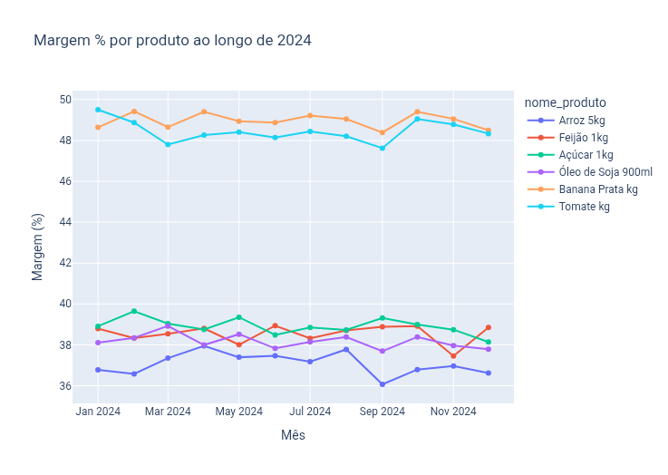
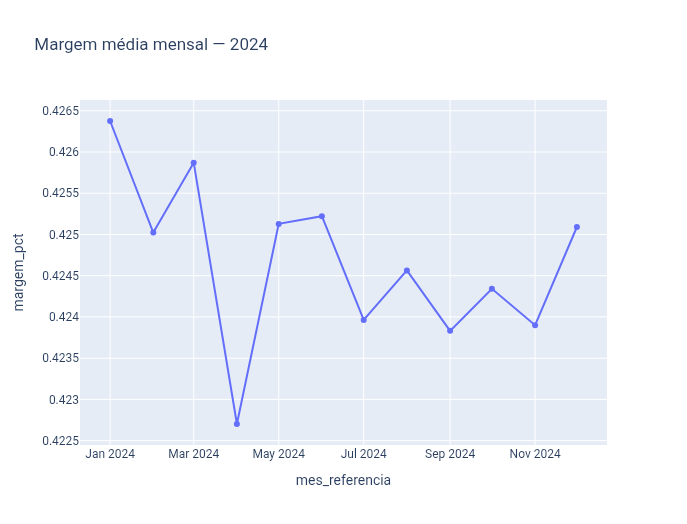

# 🛒 Custo de Vida Brasil — Case de Margem no Varejo

🔗 **Acesse o app:** [margem.streamlit.app](https://custo-vida-brasil-margem.streamlit.app/)

> Case completo de análise de dados que investigou uma queda de margem percebida por uma rede de supermercados — testando 9 hipóteses de causa raiz — e descobriu que a queda nunca existiu: era um artefato visual de escala de gráfico.


*Margem por produto ao longo do ano — a variação entre produtos já sugere que a oscilação é normal, não uma tendência de queda.*


*O gráfico que revelou o problema: com o eixo Y truncado (0.4225–0.4265), uma oscilação de ~0.4pp parece um colapso dramático de margem — quando na verdade está bem dentro do ruído natural do negócio.*

---

## 📋 Sobre o projeto

A **Rede Sabor & Cia Supermercados** (empresa fictícia) reportava faturamento estável, mas percebia uma queda preocupante na margem de lucro. Conduzi este case como consultoria completa de dados: entrevista de descoberta, formulação de hipóteses, coleta e tratamento de dados, testes estatísticos e entrega de recomendação de negócio — reproduzindo o fluxo de trabalho de um Analista de Dados Júnior numa engajamento real.

**Resultado central:** das 9 hipóteses testadas (custos de fornecedor, mix de produtos, ruptura de estoque, marketing, inflação/IPCA, sazonalidade, entre outras), nenhuma explicava uma queda real de margem — porque a queda nunca aconteceu. A oscilação observada (~0.4pp) estava bem dentro da variação normal e esperada do negócio (~1.27pp). O "problema" era a leitura de um gráfico com eixo Y mal escalado, somada à análise isolada de um único trimestre.

---

## ❓ Perguntas de negócio

- A margem da rede realmente caiu, ou é uma percepção distorcida?
- Custos de fornecedores subiram sem repasse ao preço final?
- Descontos, ruptura de estoque ou mix de produtos explicam a variação?
- A inflação (IPCA) pressionou descontos ou custos-base?
- Existe diferença relevante entre lojas, regiões ou canais de venda?

---

## 🔬 Hipóteses testadas

| # | Hipótese | Resultado |
|---|---|---|
| 1 | Desconto concentrado em produtos/períodos específicos | Refutada |
| 2 | Marketing ineficiente | Refutada (correlação espúria) |
| 3 | Custo do fornecedor subindo sem repasse ao preço | Refutada |
| 4 | Mudança de mix de produtos (alta → baixa margem) | Refutada |
| 5 | Ruptura de estoque causando reposição emergencial mais cara | Refutada |
| 6 | Logística/frete mais caro em lojas do interior | Refutada |
| 7 | Repasse de inflação (IPCA) via aumento de desconto | Refutada |
| 8 | Canal de venda (Delivery/App vs. Loja Física) impactando margem | Refutada |
| 9 | Sazonalidade (datas comemorativas afetando margem) | Refutada / Não-testável |

Detalhamento completo de cada teste está no notebook e na tabela `resumo_hipoteses` da camada analytics.

---

## 💡 Descoberta central e recomendação

- **Achado:** a margem nunca caiu de fato — a oscilação real (~0.4pp) está bem abaixo do ruído natural do negócio (~1.27pp, o benchmark validado empiricamente).
- **Causa da percepção:** o cliente analisou um único trimestre isoladamente (Q2, cujo mês mais baixo do ano concentrava o "alarme"), sem comparação com uma faixa de variação normal.
- **Recomendação:** adotar 1.27pp como benchmark oficial de ruído para análises futuras de margem, evitando alarmes falsos e decisões precipitadas baseadas em oscilações normais do negócio.

---

## 🏗️ Arquitetura do pipeline

```
data/
├── raw/          # Dados originais (internos fictícios + IPCA/IBGE real)
├── processed/    # Dados limpos, padronizados e validados
└── analytics/    # Tabelas prontas para consumo do dashboard
```

**Camadas:**
- **RAW:** vendas, estoque, marketing, lojas, categorias e produtos (dados internos fictícios) + IPCA via API SIDRA/IBGE (dado público real)
- **PROCESSED:** dados tratados, tipados, sem nulos ou duplicidades, com merges validados
- **ANALYTICS:** `margem_mensal_com_ruido`, `resumo_hipoteses`, `comparativo_produtos` — as três tabelas que alimentam o dashboard

---

## 🛠️ Tecnologias

- **Linguagem:** Python
- **Manipulação de dados:** pandas, numpy
- **Visualização:** Plotly
- **Dados públicos:** sidrapy (API IBGE/SIDRA — IPCA)
- **Armazenamento:** Parquet
- **Dashboard:** Streamlit (Community Cloud)
- **Versionamento:** Git + GitHub
- **Ambiente de desenvolvimento:** Google Colab (100% mobile)

---

## 📊 Dashboard

O dashboard interativo tem 3 telas navegáveis via menu lateral:

1. **Margem vs. Ruído** — gráfico de linha da margem mensal com faixa de ruído natural (±1.27pp)
2. **Resumo das Hipóteses** — tabela colorida com o status de cada uma das 9 hipóteses testadas
3. **Comparativo de Produtos** — ranking de variação máxima mensal por produto, com filtro por categoria

Um bloco fixo de **Conclusões e Recomendações de Negócio** aparece em todas as telas, traduzindo os achados técnicos em decisão prática.

▶️ **Acesse:** [margem.streamlit.app](https://margem.streamlit.app)

---

## 💻 Como rodar localmente

```bash
git clone https://github.com/klaytonsi/custo-vida-brasil-margem-varejo-.git
cd custo-vida-brasil-margem-varejo-
pip install -r requirements.txt
streamlit run app.py
```

---

## ⚠️ Limitações da análise

- **Dados internos sintéticos:** os dados operacionais da rede (vendas, estoque, marketing) são fictícios, gerados para fins educacionais. Os dados de inflação (IPCA) são reais e públicos (IBGE/SIDRA). Essa combinação híbrida foi uma decisão deliberada de portfólio, documentada de forma transparente.
- **Um único ano de dados:** a análise de sazonalidade fica limitada — não é possível comparar o mesmo período entre anos diferentes.
- **Case educacional:** este projeto não representa experiência profissional real nem consultoria contratada; é um exercício de portfólio para demonstrar processo analítico completo.

---

## 🚀 Próximos passos

- Adicionar testes automatizados (pytest) sobre as etapas de validação do pipeline
- Publicar o notebook no Kaggle com narrativa completa
- Expandir a série histórica (múltiplos anos) para testar sazonalidade de forma robusta
- Adicionar GitHub Actions para atualização automatizada do IPCA

---

## 🧠 Principais decisões técnicas

- **Benchmark de ruído (1.27pp):** validado empiricamente como a variação média mês a mês por produto, e não assumido a priori — evita comparar a margem contra um limiar arbitrário.
- **Validação de causalidade:** a hipótese de marketing ineficiente foi inicialmente aceita por correlação, mas refutada após identificar que cidades maiores geravam mais receita independente do investimento em marketing — um exemplo de correlação espúria corrigido durante o processo.
- **Y-axis como fonte de viés:** o achado central só emergiu ao plotar a margem com escala completa (0–100%) em vez da escala truncada que o gestor fictício vinha usando — reforça a importância de validar impressões visuais contra o intervalo real dos dados.

---

## 📄 Licença

Este projeto está sob a licença MIT. Veja o arquivo `LICENSE` para mais detalhes.

---

**Desenvolvido por Klayton** — [LinkedIn](https://www.linkedin.com/in/klayton-silva-9b5a23428) · [GitHub](https://github.com/klaytonsi)
